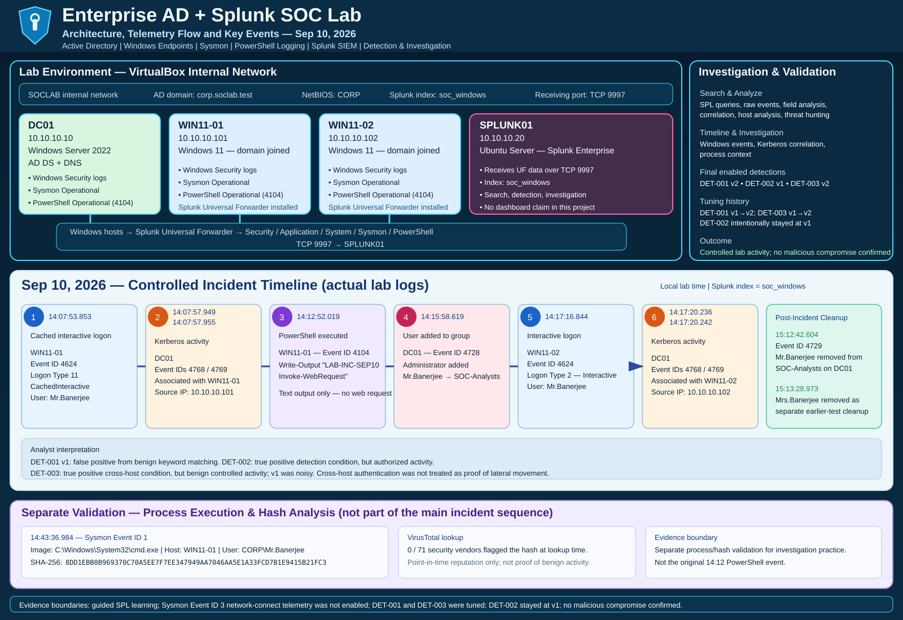

# Enterprise Active Directory + Splunk SOC Lab

I built this lab to get more practice with Windows, Active Directory, Splunk, and the kind of investigation work I would expect in a SOC role.

The environment has one domain controller, two Windows 11 workstations, and a separate Splunk server. I used it to collect Windows telemetry, create and test detections, investigate a controlled activity sequence, tune noisy logic, and run a follow-up threat hunt.

## Project overview



**Quick links:** [Incident Investigation](investigations/sep10-incident-investigation.md) · [Detection Tuning Report](investigations/detection-tuning-report.md) · [Evidence Gallery](evidence/README.md) · [SPL Searches](spl/README.md)

## Lab setup

| System | Role | IP |
|---|---|---|
| `DC01` | Windows Server 2022, Active Directory Domain Services, DNS | `10.10.10.10` |
| `SPLUNK01` | Ubuntu Server, Splunk Enterprise | `10.10.10.20` |
| `WIN11-01` | Windows 11 domain workstation | `10.10.10.101` |
| `WIN11-02` | Windows 11 domain workstation | `10.10.10.102` |

- Domain: `corp.soclab.test`
- NetBIOS: `CORP`
- VirtualBox internal network: `SOCLAB`
- Splunk index: `soc_windows`
- Splunk receiving port: `9997`

## What I collected

The Windows hosts forward logs to Splunk through the Universal Forwarder. The project includes:

- Windows Application, Security, and System logs
- PowerShell Operational logs with Script Block Logging (`4104`)
- Sysmon Operational logs, including process creation (`Event ID 1`)
- successful logons (`4624`)
- AD group-membership events (`4728`, `4729`)
- Kerberos events (`4768`, `4769`)

The forwarder input configuration is kept in [`configs/splunk-forwarder-inputs.conf`](configs/splunk-forwarder-inputs.conf).

## Detections

| Detection | What it looks for | Final state |
|---|---|---|
| [DET-001 v1](detections/DET-001-Suspicious-PowerShell-v1.md) | Broad suspicious PowerShell keyword matching | Disabled |
| [DET-001 v2](detections/DET-001-Suspicious-PowerShell-v2.md) | Tuned suspicious PowerShell activity | Enabled |
| [DET-002 v1](detections/DET-002-AD-Group-Membership-v1.md) | AD security-group membership changes | Enabled |
| [DET-003 v1](detections/DET-003-Cross-Host-Authentication-v1.md) | Broad same-user cross-host authentication | Disabled |
| [DET-003 v2](detections/DET-003-Cross-Host-Authentication-v2.md) | Tuned human-user cross-host correlation | Enabled |

The SPL files are in [`spl/`](spl/).

### SPL note

I built and tested the SPL with guidance while learning Splunk search syntax. I implemented the searches in my own lab, tested them against my telemetry, debugged extraction problems, tuned the noisy rules, and retested the final versions. I do not claim that I wrote every query independently from scratch.

## Sep 10 controlled activity

I created one controlled sequence so I could work through several alerts as one investigation instead of testing each rule in isolation.

The sequence was:

1. `CORP\Mr.Banerjee` authenticated on `WIN11-01`.
2. PowerShell Event ID `4104` recorded `Write-Output "LAB-INC-SEP10 Invoke-WebRequest"`.
3. `Administrator` added `Mr.Banerjee` to `SOC-Analysts` on `DC01`.
4. `Mr.Banerjee` authenticated on `WIN11-02`.
5. `DC01` recorded Kerberos `4768`/`4769` activity associated with the two workstation IPs.
6. The group membership was removed later during cleanup.

The three detections all matched something in the exercise, but they did not all mean the same thing. That became the main point of the investigation.

The full timeline and reasoning are in [`investigations/sep10-incident-investigation.md`](investigations/sep10-incident-investigation.md).

## What I found

### DET-001 — PowerShell false positive

DET-001 v1 fired because the Script Block contained the text `Invoke-WebRequest`.

The actual command was:

```powershell
Write-Output "LAB-INC-SEP10 Invoke-WebRequest"
```

It only printed the text. It did not make a web request. I treated this as a false positive caused by broad keyword matching.

I then changed the v2 logic so `Invoke-WebRequest` and `DownloadString(` require URL context, while stronger patterns such as `FromBase64String(` and `Invoke-Expression` are still kept. The old benign marker returned `0` results with v2, and a controlled `FromBase64String("QQ==")` test still matched.

### DET-002 — correct detection, authorized activity

DET-002 detected the real addition and removal of `Mr.Banerjee` from `SOC-Analysts`.

The detection itself was correct. The investigation showed that the change was authorized lab activity. I left DET-002 at v1 because I did not find a detection-logic problem that justified creating a v2 just for the sake of having one.

### DET-003 — useful condition, noisy v1

DET-003 v1 found the same user on both Windows workstations, but it was too broad. Service/machine accounts, the account field, logon types, and overlapping alert windows all contributed noise.

The v2 search extracts the actual `New Logon` user, filters common service and machine identities, keeps logon types `2`, `10`, and `11`, and requires the same user to appear on both workstations within `900` seconds.

I still do not treat a cross-host match as proof of lateral movement. It is an alert condition that needs context.

## Process-tree practice

The original 14:12 PowerShell event did not create the process tree below. I generated a separate controlled test later so I could practice Sysmon process correlation.

```text
CORP\Mr.Banerjee
└── powershell.exe
    └── cmd.exe
        └── conhost.exe
```

The observed `cmd.exe` SHA-256 was:

```text
8DD1EBB0B969370C70A5EE7F7EE347949AA7046AA5E1A33FCD7B1E9415B21FC3
```

VirusTotal showed `0/71` vendors flagging the hash at the time I checked it. I used that as enrichment only. A legitimate binary can still be used in malicious activity, so the reputation result was not enough to decide the case by itself.

## Threat hunt

After the initial alert investigation, I searched the collected telemetry for related activity instead of stopping with the three alerts.

I checked for:

- similar PowerShell activity on other hosts
- additional PowerShell-to-`cmd.exe` process chains
- other unexplained group-membership changes
- other human users matching the same cross-host condition

I did not find additional matching suspicious activity in the telemetry and time window I searched. That conclusion only applies to the data I actually collected.

## MITRE ATT&CK mapping

I only mapped activity that was visible in the lab telemetry:

- `T1059.001` — PowerShell
- `T1059.003` — Windows Command Shell
- `T1098.007` — Additional Local or Domain Groups

I did not map a download technique from the text `Invoke-WebRequest`, and I did not map lateral movement from the cross-host logons alone.

## Evidence

The screenshots are collected in [`evidence/README.md`](evidence/README.md). The gallery includes:

- VirtualBox lab inventory and Splunk host ingestion
- the Sep 10 PowerShell `4104` marker
- AD group-membership evidence
- cross-host `4624` logons and Kerberos correlation
- Sysmon process/hash evidence and VirusTotal lookup
- threat-hunt screenshots
- DET-001 v2 negative and positive retests
- DET-003 v2 historical validation
- final enabled/disabled alert state

## Known limitations

- Sysmon Event ID `3` network-connect telemetry was not enabled during the Sep 10 activity, so I could not use Sysmon to make a firm conclusion about network activity in that window.
- This was a controlled home lab, not a production SOC, and no malicious compromise was confirmed.
- Splunk Triggered Alerts entries were retained for only 24 hours in this lab. The original Sep 10 Triggered Alerts list had expired by the time I built the final evidence set. I kept the underlying events, validation results, and final alert configuration instead.
- The original Splunk saved-alert exports for DET-001 v1 and DET-002 v1 were not retained separately. The repository versions reflect the versions documented during the project.
- The SPL was built with guidance while I was learning and should not be read as independently authored from scratch.
- The detections are lab-specific and would need more baseline data and tuning before production use.

## Repository structure

```text
spl/             Splunk searches
detections/      Detection logic, validation, and tuning notes
configs/         Sanitized Splunk Universal Forwarder input configuration
investigations/  Investigation and tuning reports
evidence/        Screenshots from architecture, incident, hunting, and tuning work
```
