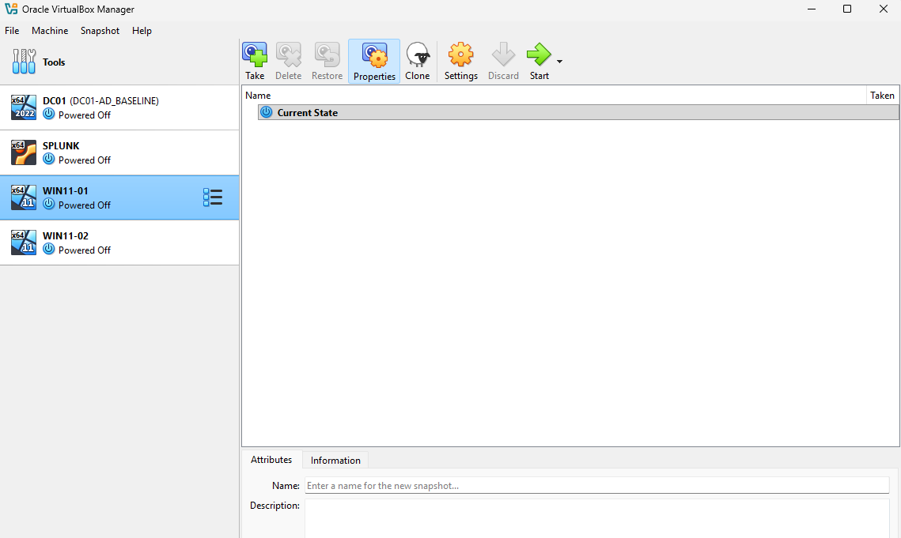
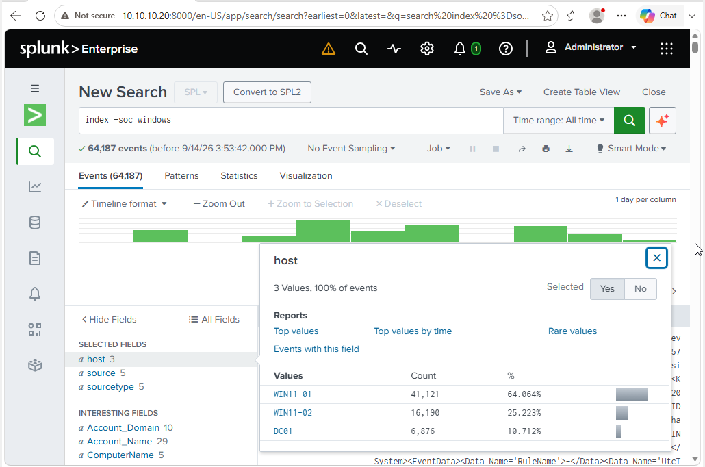
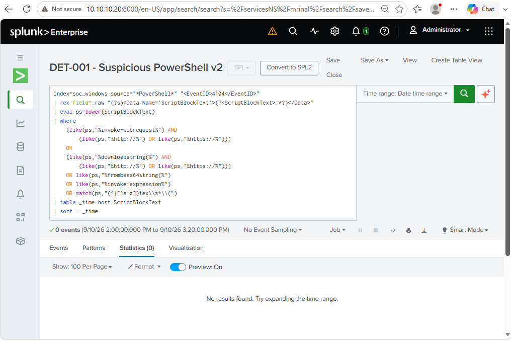
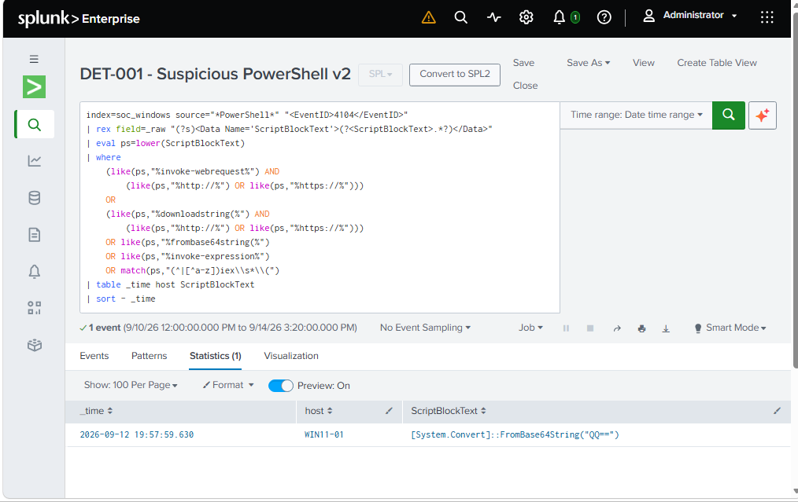
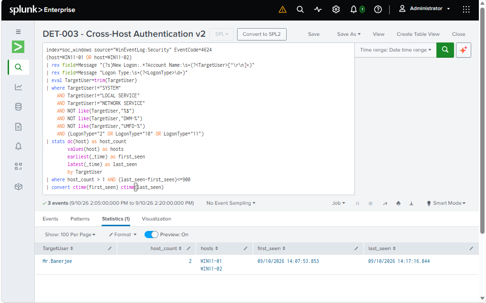
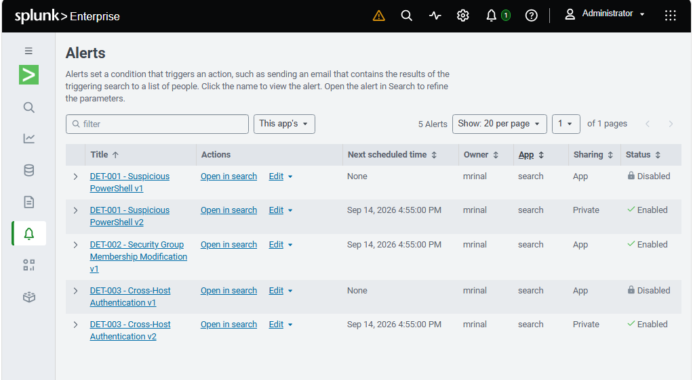

# Evidence Gallery

This page is designed so a reviewer can inspect the main project proof without hunting through folders. Each image is shown inline, followed by what it supports and the boundary of that evidence.

> The screenshots are the primary visual proof. The written investigation and tuning reports explain how the evidence was interpreted.

## Project overview

**Supports:** evidence-backed visual summary of the lab architecture, telemetry flow, Sep 10 controlled incident timeline, separate process/hash validation, and final detection states.

**Boundary:** this is a summary graphic assembled from documented project evidence; the underlying screenshots and reports remain the primary proof.

## Architecture and ingestion

### VirtualBox lab inventory

**Supports:** the lab contains `DC01`, the Splunk VM, `WIN11-01`, and `WIN11-02`.

**Boundary:** VM presence alone does not prove service health or network connectivity.

### Splunk host ingestion

**Supports:** `soc_windows` contains events from `DC01`, `WIN11-01`, and `WIN11-02`.

**Boundary:** host counts prove ingestion was occurring, not complete telemetry coverage.

## Sep 10 incident evidence

### PowerShell Event ID 4104

**Supports:** `WIN11-01` recorded the controlled Script Block `Write-Output "LAB-INC-SEP10 Invoke-WebRequest"` at the documented Sep 10 time.

**Boundary:** the event proves the string was logged; it does not show that an actual web request occurred.

### Active Directory group addition — Event ID 4728

**Supports:** `Administrator` added `Mr.Banerjee` to `SOC-Analysts`.

**Boundary:** the event proves the group change, not malicious intent.

### Cross-host authentication

**Supports:** `Mr.Banerjee` had successful `4624` logons on both `WIN11-01` and `WIN11-02`.

**Boundary:** cross-host authentication does not by itself prove lateral movement or compromise.

### Kerberos correlation

**Supports:** `DC01` recorded `4768`/`4769` activity associated with `10.10.10.101` and `10.10.10.102`.

**Boundary:** Kerberos activity corroborates authentication context; it does not establish malicious intent.

## Separate process and hash validation

### Sysmon process/hash evidence

**Supports:** Sysmon telemetry recorded the SHA-256 associated with `C:\Windows\System32\cmd.exe` during the separate process-tree validation.

**Boundary:** the hash identifies the observed binary; it does not determine whether the surrounding activity was benign.

### VirusTotal enrichment

**Supports:** VirusTotal showed `0/71` security vendors flagging the hash at the time of lookup.

**Boundary:** reputation is point-in-time external enrichment and does not prove that the activity was safe.

## Threat-hunt evidence

### PowerShell to cmd.exe process-chain hunt

**Supports:** the investigated Sysmon window produced one PowerShell-to-`cmd.exe` process-chain match on `WIN11-01` for `CORP\Mr.Banerjee`.

**Boundary:** the result only describes telemetry available in the searched window.

### AD group-membership hunt

**Supports:** group-membership activity in the investigated window was reviewed for the known add/remove events.

**Boundary:** the hunt does not prove no uncollected or out-of-window group changes occurred.

## Detection tuning and validation evidence

### DET-001 v2 — negative retest

**Supports:** DET-001 v2 returned `0` results over the window containing the original benign marker.

**Boundary:** a zero result is specific to the tested query and time range.

### DET-001 v2 — positive validation

**Supports:** DET-001 v2 returned a controlled `FromBase64String("QQ==")` match.

**Boundary:** the test validates one retained pattern; it does not prove complete PowerShell detection coverage.

### DET-003 v2 — historical validation

**Supports:** DET-003 v2 correlated `Mr.Banerjee` across `WIN11-01` and `WIN11-02` within the 15-minute condition.

**Boundary:** the result proves the correlation condition, not malicious lateral movement.

### Final saved-alert state

**Supports:** DET-001 v1 disabled, DET-001 v2 enabled, DET-002 v1 enabled, DET-003 v1 disabled, and DET-003 v2 enabled.

**Boundary:** the final configuration does not preserve the expired Sep 10 Triggered Alerts UI history.

## Retention limitation

Splunk Triggered Alerts entries were retained for only 24 hours in this lab. The Sep 10 Triggered Alerts UI history was therefore no longer available when the final evidence set was collected. The repository instead preserves the underlying telemetry, historical validation searches, tuning results, and final alert configuration.

This is an evidence limitation, not something the project attempts to hide. Any future alert screenshots should be labeled as later validation/retesting rather than historical Sep 10 alert proof.

[Return to project README](../README.md) · [Read the Sep 10 investigation](../investigations/sep10-incident-investigation.md) · [Read the tuning report](../investigations/detection-tuning-report.md)
