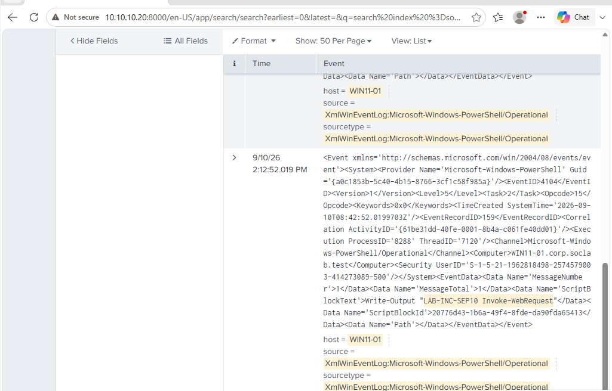
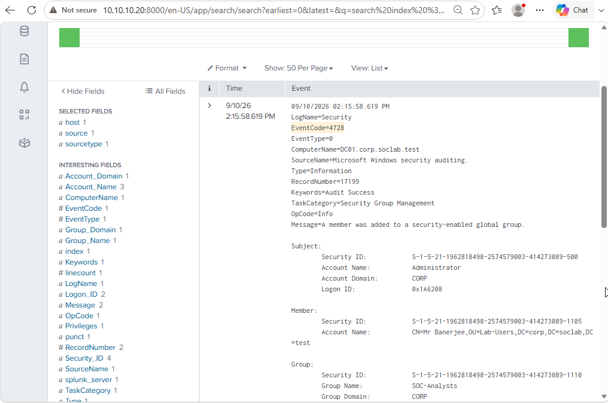
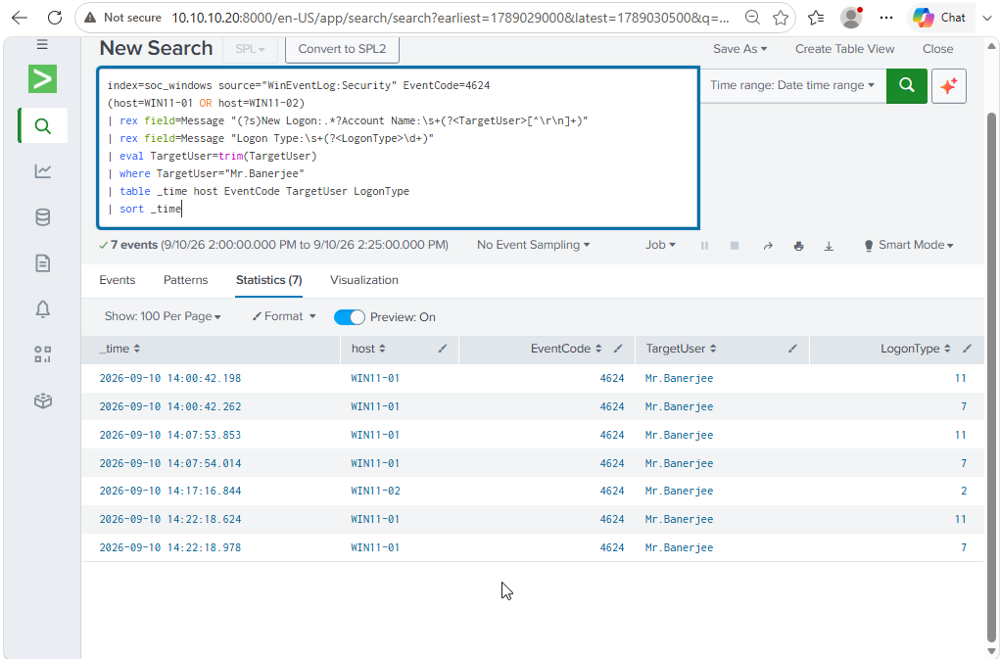
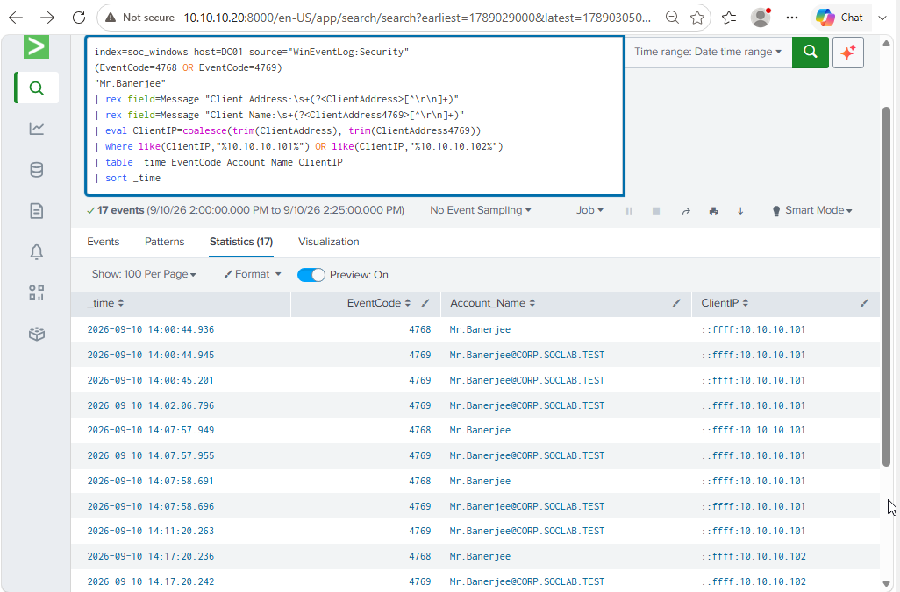
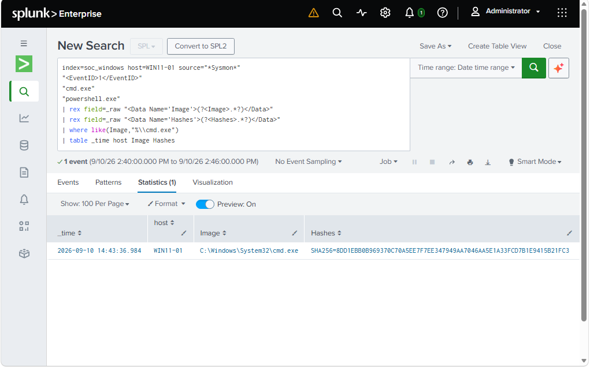
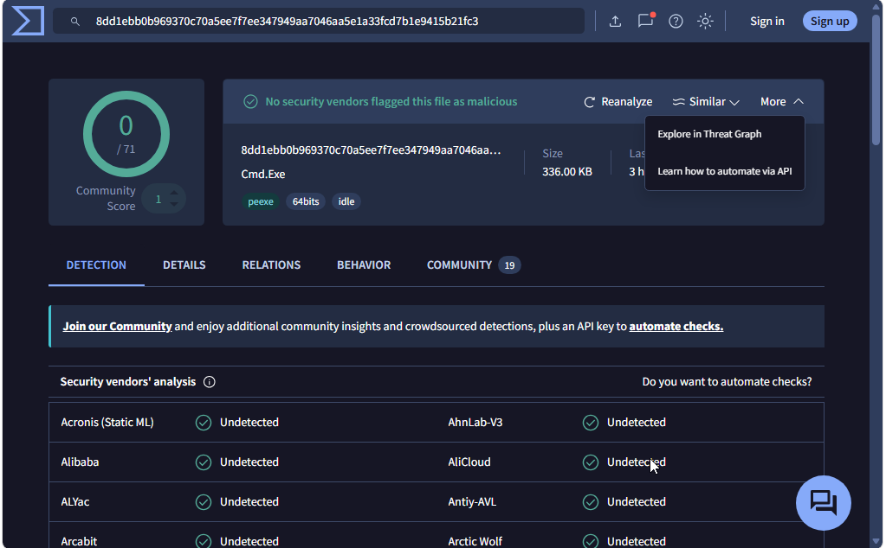
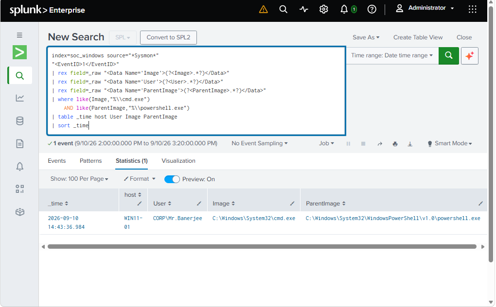
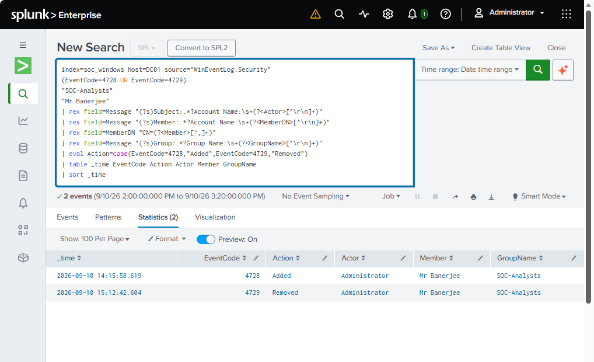

# Sep 10 Controlled Incident Investigation

## 1. Incident Summary

On Sep 10, I ran a controlled activity sequence inside the `corp.soclab.test` lab to test how multiple Splunk detections would behave together and then investigated the alerts as if they had entered a SOC queue.

The activity involved `CORP\Mr.Banerjee`, `WIN11-01`, `WIN11-02`, and `DC01`. It generated three detections:

- DET-001 — Suspicious PowerShell
- DET-002 — AD Group Membership Modification
- DET-003 — Cross-Host Authentication

The important part of the exercise was not only confirming that alerts fired. I wanted to determine what actually happened, what the alerts meant, whether the activity was malicious or benign, and what needed tuning.

My final conclusion was that this was authorized controlled lab activity. No malicious compromise was confirmed. The three alerts required different analyst interpretations: DET-001 was a false positive caused by a benign keyword match, DET-002 correctly detected a real but authorized group change, and DET-003 correctly found the cross-host condition but the v1 logic was noisy.

The investigation window covered approximately 14:00–15:20 local lab time on Sep 10.

## Visual evidence used in this investigation

The screenshots below are embedded here so the main claims can be reviewed without leaving the report. The [full evidence gallery](../evidence/README.md) documents the boundary of each screenshot.

| PowerShell 4104 | AD group addition 4728 |
|---|---|
|  |  |
| Logged controlled PowerShell marker on `WIN11-01`. | `Administrator` added `Mr.Banerjee` to `SOC-Analysts`. |

| Cross-host authentication | Kerberos correlation |
|---|---|
|  |  |
| Successful `4624` events for `Mr.Banerjee` on both workstations. | `4768`/`4769` activity associated with both workstation IPs. |

| Sysmon process/hash validation | VirusTotal enrichment |
|---|---|
|  |  |
| Separate validation showing the observed `cmd.exe` SHA-256. | Point-in-time external enrichment showing `0/71` detections. |

---

## 2. Alerts Triggered

### DET-001 — Suspicious PowerShell v1

This detection monitored PowerShell Script Block Logging and looked for suspicious keywords such as `Invoke-WebRequest`, `DownloadString`, `Invoke-Expression`, `IEX`, Base64-related strings, and encoded-command indicators.

The alert fired on `WIN11-01` after the controlled PowerShell command:

```powershell
Write-Output "LAB-INC-SEP10 Invoke-WebRequest"
```

The command only printed text. It did not perform an actual web request.

### DET-002 — Security Group Membership Modification v1

This detection monitored Active Directory security-group changes on `DC01`.

The incident produced:

- Event ID `4728` when `Administrator` added `Mr.Banerjee` to `SOC-Analysts`
- Event ID `4729` when `Administrator` later removed `Mr.Banerjee`

### DET-003 — Cross-Host Authentication v1

This detection looked for the same account appearing in successful logon events on both `WIN11-01` and `WIN11-02`.

The alert condition was met after `Mr.Banerjee` authenticated on both workstations. The v1 detection later proved too broad because account-field handling, service identities, and overlapping alert windows created unnecessary noise and repeated alerting.

---

## 3. Investigation Timeline

| Time | Host | Event / Activity | Investigation meaning |
|---|---|---|---|
| 14:07:53.853 | WIN11-01 | Event `4624`, `Mr.Banerjee`, Logon Type `11` | Cached interactive authentication on WIN11-01 |
| 14:07:57.949 | DC01 | Kerberos `4768` from `10.10.10.101` | TGT request associated with WIN11-01 |
| 14:07:57.955 | DC01 | Kerberos `4769` associated with WIN11-01 | Service-ticket activity corroborating authentication |
| 14:12:52.019 | WIN11-01 | PowerShell `4104` — `Write-Output "LAB-INC-SEP10 Invoke-WebRequest"` | Primary DET-001 event; text output only |
| 14:15:58.619 | DC01 | Event `4728` | `Administrator` added `Mr.Banerjee` to `SOC-Analysts` |
| 14:17:16.844 | WIN11-02 | Event `4624`, `Mr.Banerjee`, Logon Type `2` | Interactive authentication on WIN11-02 |
| 14:17:20.236 | DC01 | Kerberos `4768` from `10.10.10.102` | TGT request associated with WIN11-02 |
| 14:17:20.242 | DC01 | Kerberos `4769` associated with WIN11-02 | Service-ticket activity corroborating authentication |
| 14:42:59.991 | WIN11-01 | Second PowerShell marker | Separate controlled validation/retest, not the original incident event |
| 14:43:36.984 | WIN11-01 | Sysmon Event ID `1` | `cmd.exe` launched from PowerShell during process-tree validation |
| 15:12:42.604 | DC01 | Event `4729` | `Administrator` removed `Mr.Banerjee` from `SOC-Analysts` |
| 15:13:28.973 | DC01 | Event `4729` | Separate cleanup: `Mrs.Banerjee` removed from `SOC-Analysts` |

The first incident sequence was therefore approximately:

`WIN11-01 authentication → PowerShell alert → AD group addition → WIN11-02 authentication`

The later 14:42–14:43 activity was a separate controlled validation that I used to inspect process relationships and should not be merged into the original 14:12 PowerShell event.

---

## 4. PowerShell Analysis

The primary PowerShell event was Event ID `4104` on `WIN11-01`:

```powershell
Write-Output "LAB-INC-SEP10 Invoke-WebRequest"
```

DET-001 v1 fired because the Script Block contained the string `Invoke-WebRequest`.

When I reviewed the actual command, I found that `Invoke-WebRequest` was only text passed to `Write-Output`. There was no URL, no web request, and no evidence in that command of a download or remote retrieval.

This was an important distinction. The alert logic matched exactly what it was configured to match, but the security meaning of the event was benign. I therefore classified DET-001 as a false positive caused by broad keyword matching.

This finding later became the reason for tuning DET-001 into v2. The tuned rule required stronger context for download-related patterns and the original benign marker no longer matched during retesting.

---

## 5. Process Tree Analysis

The original 14:12 PowerShell event did not itself create the process chain below. I generated a separate controlled validation later so I could practice process-tree analysis with Sysmon Event ID `1`.

On `WIN11-01`, the relevant relationship was:

```text
CORP\Mr.Banerjee
└── powershell.exe  (PID 3540)
    └── cmd.exe     (PID 9744)
        └── conhost.exe
```

The parent process was:

```text
C:\Windows\System32\WindowsPowerShell\v1.0\powershell.exe
```

The child was:

```text
C:\Windows\System32\cmd.exe
```

Sysmon also provided `ProcessGuid` and `ParentProcessGuid`, which are more reliable for process correlation than PID alone because Windows PIDs can be reused.

The process chain showed how I should investigate context rather than deciding that a binary is suspicious only because of its name. In this case the process relationship was created deliberately in the lab and did not represent confirmed malicious execution.

---

## 6. Active Directory Group Membership Analysis

At `14:15:58.619`, `DC01` recorded Event ID `4728` showing that `Administrator` added `Mr.Banerjee` to the `SOC-Analysts` group.

Later, at `15:12:42.604`, Event ID `4729` recorded `Administrator` removing `Mr.Banerjee` from the same group.

This was a real Active Directory security change and DET-002 correctly detected it.

The detection itself was therefore a true positive for the monitored condition. However, after reviewing the actor, target user, timing, and lab context, I determined that the action was authorized controlled activity rather than malicious privilege manipulation.

A second removal event at `15:13:28.973` involved `Mrs.Banerjee`. That event was cleanup from earlier lab testing and was not part of the primary Sep 10 incident sequence.

This part of the investigation reinforced that a technically correct alert is not automatically a security incident. The analyst still needs to determine whether the change was expected, approved, or suspicious.

---

## 7. Cross-Host Authentication and Kerberos Correlation

DET-003 v1 detected `Mr.Banerjee` on both Windows workstations.

The authentication sequence was:

- `14:07:53.853` — `Mr.Banerjee` on `WIN11-01`, Logon Type `11`
- `14:17:16.844` — `Mr.Banerjee` on `WIN11-02`, Logon Type `2`

I then correlated the workstation logons with Kerberos telemetry on `DC01`.

For `WIN11-01`, the domain controller recorded:

- `4768` from `10.10.10.101` at `14:07:57.949`
- `4769` immediately after at `14:07:57.955`

For `WIN11-02`, the domain controller recorded:

- `4768` from `10.10.10.102` at `14:17:20.236`
- `4769` immediately after at `14:17:20.242`

The Kerberos events corroborated that the same domain user had authentication activity associated with both workstation IP addresses.

The observed Kerberos encryption type was `0x12` (AES-256), which was consistent with normal modern Windows authentication in this lab.

I did **not** classify the cross-host login as proof of lateral movement. The evidence proved the authentication condition, not malicious intent. In a real incident I would continue correlating endpoint, identity, process, network, and account context before making that conclusion.

---

## 8. IOC and Hash Enrichment

During the separate process-tree validation, Sysmon provided the SHA-256 value for `cmd.exe`:

```text
8DD1EBB0B969370C70A5EE7F7EE347949AA7046AA5E1A33FCD7B1E9415B21FC3
```

External enrichment indicated that the hash was consistent with legitimate Windows `cmd.exe` rather than a known malicious binary.

I did not use that result to declare the activity benign by itself. A legitimate Windows binary can still be used as part of malicious activity. The value of enrichment here was to help answer one specific question: whether the observed executable appeared to be a known malicious replacement or an expected Windows binary.

The final interpretation therefore remained context-based: legitimate binary, controlled process chain, and no other evidence showing malicious use in this exercise.

---

## 9. Scope Assessment

The primary identity in scope was:

```text
CORP\Mr.Banerjee
```

Relevant evidence was identified on three systems:

- `WIN11-01`
- `WIN11-02`
- `DC01`

These were the systems containing evidence related to the activity. I do **not** classify all three as compromised systems.

During the investigated window, the logs showed relevant authentication, PowerShell, group-membership, Kerberos, and process-creation evidence across those hosts. The evidence supported the controlled activity sequence but did not establish malware execution, persistence, unauthorized privilege escalation, or confirmed account compromise.

### Network telemetry limitation

Sysmon Event ID `3` network-connect telemetry was not enabled in the Sysmon configuration during this activity.

A search around the process-tree validation period returned no Sysmon Event ID `3` results, but that does **not** mean no network activity occurred.

The correct conclusion is:

> Network activity could not be conclusively assessed from Sysmon because network-connect telemetry was not collected during the incident.

---

## 10. MITRE ATT&CK Mapping

I mapped only activity that was directly supported by the telemetry.

| Technique | Name | Evidence |
|---|---|---|
| `T1059.001` | PowerShell | PowerShell Script Block Logging and controlled PowerShell execution |
| `T1059.003` | Windows Command Shell | `cmd.exe` launched as a child of PowerShell during separate controlled process-tree validation |
| `T1098.007` | Additional Local or Domain Groups | `Mr.Banerjee` added to `SOC-Analysts` on DC01 |

I did not map a download technique simply because `Invoke-WebRequest` appeared as text, and I did not claim a confirmed lateral-movement technique from cross-host authentication alone.

---

## 11. Independent Threat Hunt

After reviewing the three alerts, I performed a separate hunt instead of stopping at the alert results.

### PowerShell activity across hosts

I searched the incident window for other PowerShell `4104` activity matching the suspicious patterns. The relevant matching activity was on `WIN11-01`; I did not identify the same suspicious pattern on the other hosts in the collected telemetry.

### PowerShell → cmd.exe process-chain hunt

I searched Sysmon process-creation events for PowerShell spawning `cmd.exe`.

The hunt produced one relevant match:

- Host: `WIN11-01`
- User: `CORP\Mr.Banerjee`
- Time: `14:43:36.984`

This was the controlled process-tree validation already identified during the investigation.



### Group-membership hunt

I searched for group-membership activity using the relevant security-event IDs (`4728`, `4729`, `4732`, `4733`, `4756`, `4757`).

The relevant results were the known lab events:

- `Mr.Banerjee` added to `SOC-Analysts`
- `Mr.Banerjee` removed from `SOC-Analysts`
- `Mrs.Banerjee` removed as separate cleanup from earlier testing

I did not identify an additional unexplained group addition in the investigated window.



### Human-account cross-host hunt

I also searched for other human accounts showing the same cross-host pattern after filtering identities such as `SYSTEM`, `LOCAL SERVICE`, `NETWORK SERVICE`, machine accounts, `DWM-*`, and `UMFD-*`.

No additional human-user match was identified in the collected telemetry during the investigated window.

### Threat-hunt conclusion

No additional matching suspicious activity was identified in the collected telemetry during the investigated time window.

This wording is deliberate. The hunt can only describe what was visible in the telemetry I actually collected; it cannot prove that nothing else happened.

---

## 12. True Positive / False Positive / Benign Assessment

### DET-001 — False positive — benign keyword match

The detection condition matched because `Invoke-WebRequest` appeared in the Script Block, but the command only printed the string. No actual web request was executed by that command.

**Disposition:** False positive — benign keyword match caused by broad v1 logic.

### DET-002 — True positive, authorized activity

The group-membership change really occurred and the rule correctly detected it. The action was performed deliberately by `Administrator` as part of the controlled lab scenario.

**Disposition:** True positive detection condition; authorized benign activity.

### DET-003 — True positive condition, noisy v1 logic

The same user really authenticated on both workstations. However, the original detection was broad and produced unnecessary noise and repeated alerts.

**Disposition:** True positive cross-host condition; benign controlled activity; detection tuning required.

---

## 13. Containment and Recommendations

No emergency containment was required in this lab because the activity was controlled and authorized.

If I received the same evidence in a real SOC environment, my L1 response would depend on what the investigation proved rather than automatically isolating systems or disabling accounts.

Recommended actions for a real case would include:

- confirm whether the group-membership change was authorized
- identify the account that performed the change and document it
- escalate unexpected security-group or privileged-group changes according to the SOC playbook
- remove unauthorized membership if the playbook and analyst authority allow it
- if account compromise is suspected, recommend account restriction, password reset, or disablement according to escalation procedures
- investigate the PowerShell Script Block and its parent/child processes before deciding it is malicious
- preserve relevant endpoint and identity evidence
- scope the same user and behavior across other systems
- isolate a workstation only if the evidence and response procedure support that action
- improve detection logic when a rule produces a known false positive or excessive repeat alerts

The main operational lesson is that containment should follow evidence and playbook authority, not simply the existence of an alert.

---

## 14. Final Analyst Conclusion

The Sep 10 investigation showed how three different alerts can point to one controlled activity sequence but still require different analyst decisions.

DET-001 v1 fired on a PowerShell keyword, but the underlying command only printed text. That made it a false positive caused by a benign keyword match and showed that the rule was too broad.

DET-002 correctly identified a real Active Directory group-membership change. The event itself was valid, but correlation with the actor and lab context showed that it was authorized.

DET-003 correctly identified the same user on two workstations, and Kerberos telemetry on `DC01` corroborated the authentication activity. However, that evidence alone did not prove lateral movement or account compromise. The v1 detection also produced noise, which led to later tuning.

The independent hunt did not identify additional matching suspicious activity in the telemetry collected during the investigated window. I also documented the visibility gap created by Sysmon Event ID `3` not being enabled, rather than treating missing network events as proof that no network activity occurred.

The biggest lesson from this investigation was that an alert is only the starting point. I had to check the raw event, understand what happened before and after it, correlate endpoint and identity data, separate the primary incident from later validation activity, scope the environment, hunt beyond the original alerts, and document limitations before reaching a conclusion.

**Final disposition:** Controlled lab simulation / authorized activity. No malicious compromise confirmed.
